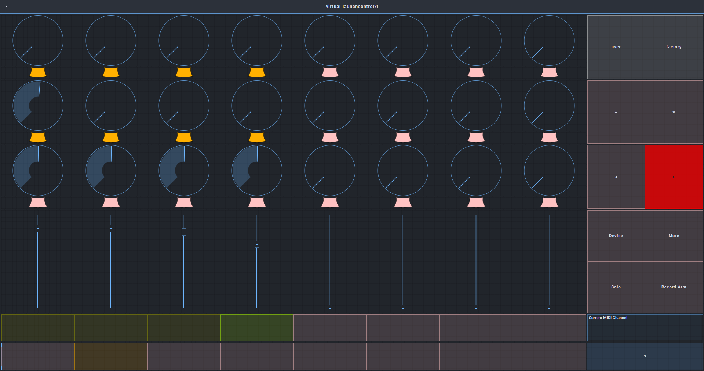

# Virtual LaunchcontrolXL

Midi device created with [Open Stage Control](https://github.com/jean-emmanuel/Open-Stage-Control/) , compatible with Ableton and Novation LaunchControlXL software

[](o-s-c-logo.png)

Note: There is no will at all to make any earnings out of it, just so you guys can enjoy the experience as close as  having the Real Hardware, but just with a touchscreen, so you can work remotely whenever you don't have access to the Real Hardware you have previously purchased.

I have spent countless of hours trying to understand how everything of this works, to put it all together, but surely the rest of devs of [Open Stage Control](https://github.com/jean-emmanuel/Open-Stage-Control/) have spent  just a bit more hours than me doing **o-s-c**  . In conjunction of our superpowers , we have brought you this amazing Software Stack , completely for Free !!


### Usage Instructions

1 - Download the repo files

Open up a terminal and go to the directory you want the device to be stored in your Computer
In my case
```
cd C:\files\myrepos\freddieventura\
git clone https://github.com/freddieventura/virtual-launchcontrolxl
```

2 - **Create Virtual Midi Ports** for In and Out 
  If using Windows Use  [loopMIDI](https://www.tobias-erichsen.de/software/loopmidi.html)
    **Tip!!**: Make loopMIDI launch automaticaly upon boot
    Place a shortcut on `C:\Users\USERNAME\AppData\Roaming\Microsoft\Windows\Start Menu\Programs\Startup`

```
virtual-launchcontrolxl-in
virtual-launchcontrolxl-out
```

3 - Open it with the terminal . Run the command (note pathnames and virtual MIDI port names should be the ones you setted) 
```
$o-s-cPath --  -- --midi sysex virtual-launchcontrolxl:virtual-launchcontrolxl-out,virtual-launchcontrolxl-in -c $repoLocalPath\virtual-launchcontrolxl.js --load $repoLocalPath\virtual-launchcontrolxl.json
```
In mi case is
```
C:\files\dotfiles-win\open-stage-control\open-stage-control-1.13.2-win32-x64\open-stage-control.exe -- --midi sysex virtual-launchcontrolxl:virtual-launchcontrolxl-out,virtual-launchcontrolxl-in -c C:\files\myrepos\freddieventura\virtual-launchcontrolxl\virtual-launchcontrolxl.js --load C:\files\myrepos\freddieventura\virtual-launchcontrolxl\virtual-launchcontrolxl.json
```

4 - (Optional) (Windows) Creating a virtual-launchcontrolxl **Desktop shortcut**.
This way you dont need to open up a terminal anytime you want to launch the device 
First , create a powershell executable file
First , modify the `virtual-launchcontrolxl-init.ps1` file according to your local Paths
Second , modify the shortcut to your local Paths `C:\myPowershell\Path\powershell.exe -nologo -file "C:\pathTo\deviceInit.ps1"`

In my case
```
C:\Windows\System32\WindowsPowerShell\v1.0\powershell.exe -nologo -file "C:\files\myrepos\freddieventura\virtual-launchcontrolxl\virtual-launchcontrolxl-init.ps1"
```

5 - Set up your MIDI routing in your DAW

In my case I use Ableton Live

```
> Options > Preferences
                 >  Link / MIDI
Control Surface          Input                          Output
Launch Control XL  virtual-launchcontrolxl-in virtual-launchcontrolxl-out

MIDI Ports                                                      Track   Sync    Remote
Input: Launch_Control_XL Input (virtual-launchcontrolxl-in)     On      Off     On
Input: Launch_Control_XL Output(virtual-launchcontrolxl-in)     On      Off     On

```

6 - Connect a tablet to the o-s-c instance

First , connect both devices (Computer and Tablet) to the same Network.
Then Check your Computers IP
```
ipconfig
```
Open up a Browser in your tablet
```
http://$myComputerIP:8080
```
In my case
```
http://192.168.137.1:8080
```
**Tip!!** Bookmark that address , you are gonna use it a lot :D


### Bonus functionality


Check the Custom Script [Isotonik Launch Control XXL](https://isotonikstudios.com/product/launchcontrol-xxl/) , it allows you to create 32 Knobs , Parameter mappings. 


### Screenshot


